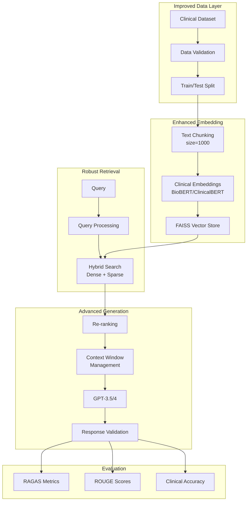

# Current RAG Pipeline Architecture

## Overview
The current implementation uses a Retrieval-Augmented Generation (RAG) system with GPT-3.5 for clinical data analysis.

```mermaid
graph TB
    subgraph "Data Preparation"
        A[Clinical Dataset<br/>Nosocomial Risk Data] --> B[DataFrame Loading<br/>haa_develChronologies<br/>haa_develAdmittimes]
        B --> C[Data Combination<br/>hadm_id + admittime]
    end
    
    subgraph "Embedding & Storage"
        C --> D[Text Splitter<br/>chunk_size=50<br/>overlap=15]
        D --> E[OpenAI Embeddings<br/>text-embedding-ada-002]
        E --> F[Vector Store<br/>DocArrayInMemorySearch]
    end
    
    subgraph "Query Processing"
        G[User Query] --> H[Query Embedding<br/>OpenAI Embeddings]
        H --> I[Similarity Search<br/>Cosine Similarity]
        F --> I
    end
    
    subgraph "Retrieval & Generation"
        I --> J[Medical Retriever<br/>as_retriever()]
        J --> K[Context Retrieval<br/>RunnableParallel]
        K --> L[LLM Processing<br/>GPT-3.5-turbo]
        L --> M[Response Generation<br/>StrOutputParser]
    end
    
    M --> N[Final Response]
    
    style A fill:#f9f,stroke:#333,stroke-width:2px
    style N fill:#9f9,stroke:#333,stroke-width:2px
    style L fill:#bbf,stroke:#333,stroke-width:2px
```

## Pipeline Components

### 1. Data Layer
- **Input**: Nosocomial Risk Dataset (PhysioNet)
- **DataFrames**: 
  - `haa_develChronologies`: Patient chronologies
  - `haa_develAdmittimes`: Admission times
- **Processing**: Combines hadm_id with admission timestamps

### 2. Embedding Layer
- **Text Splitter**: RecursiveCharacterTextSplitter
  - Chunk size: 50 characters
  - Overlap: 15 characters
- **Embedding Model**: OpenAI Embeddings (text-embedding-ada-002)
- **Vector Store**: DocArrayInMemorySearch

### 3. Retrieval Layer
- **Retriever**: Vector store converted to retriever
- **Search Method**: Cosine similarity
- **Context Assembly**: RunnableParallel for context + question

### 4. Generation Layer
- **LLM**: GPT-3.5-turbo (via ChatOpenAI)
- **Temperature**: 0.5
- **Output Parser**: StrOutputParser

## Issues Identified

### 🔴 Critical Issues

1. **API Keys Exposed in Code**
   - Lines 28, 31, 67, 93: Hardcoded OpenAI API keys
   - Security risk: Keys should be in environment variables

2. **Inconsistent Data Sources**
   - Line 33: Uses `haa_trainChronologies` 
   - Line 58, 86: Uses `haa_develChronologies`
   - Line 168: Uses `haa_develAdmittimes`
   - Unclear data flow and potential data leakage

3. **Multiple LLM Initializations**
   - Line 28: OpenAI via llama-index
   - Line 71: ChatOpenAI with different API key
   - Line 93: Another ChatOpenAI instance
   - Redundant and confusing

### 🟡 Design Issues

4. **Small Chunk Size**
   - 50 characters is extremely small for medical text
   - Will lose context and semantic meaning
   - Recommended: 500-1000 characters for clinical data

5. **Missing Components from Paper**
   - No RAGAS evaluation metrics implementation
   - No comparison with ClinicalBERT baseline
   - No ROUGE score calculation

6. **Incomplete Pipeline**
   - Line 191: Undefined `prompt` variable
   - Missing error handling
   - No persistent storage for vector embeddings

### 🟠 Code Quality Issues

7. **Mixed Libraries**
   - Uses both llama-index and langchain
   - Creates confusion and potential conflicts
   - Should standardize on one framework

8. **Jupyter Notebook Artifacts**
   - pip install commands (lines 7, 11, 13, etc.)
   - Should be in requirements.txt

9. **Unused Code**
   - PandasQueryEngine initialized but not used properly
   - Multiple test queries that don't contribute to pipeline

## Recommended Architecture



## Key Improvements Needed

1. **Security**: Move API keys to environment variables
2. **Data Management**: Clear train/test split, consistent data sources
3. **Chunking**: Increase chunk size to 500-1000 characters
4. **Embeddings**: Consider clinical-specific embeddings
5. **Storage**: Use persistent vector store (FAISS/Pinecone)
6. **Evaluation**: Implement RAGAS and ROUGE metrics
7. **Code Structure**: Refactor into modular functions/classes
8. **Error Handling**: Add comprehensive error handling
9. **Documentation**: Add docstrings and comments
10. **Testing**: Add unit tests for pipeline components